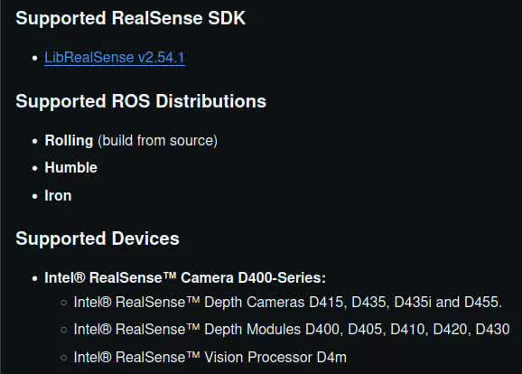
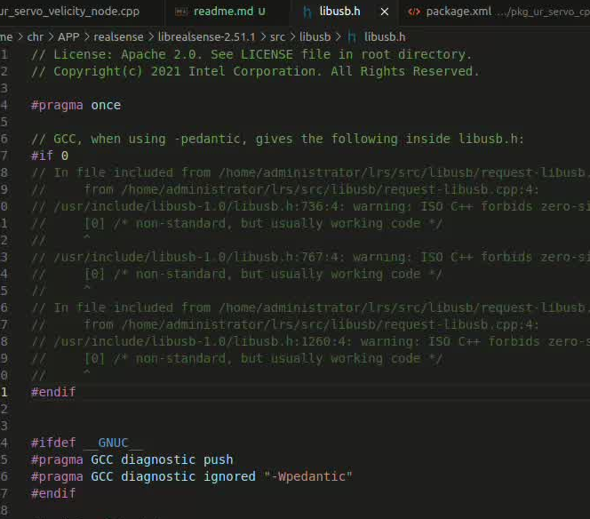

# RealSense ROS 驱动安装说明

## 1. 版本选择

- 访问 [RealSense ROS Releases](https://github.com/IntelRealSense/realsense-ros/releases)
- 查看 ROS 驱动的版本，注意支持的 ROS 版本和 RealSense SDK 版本对应关系  
  
- 挑选好对应的版本后，下载对应的压缩包

## 2. 安装教程

- 参考：[CSDN 安装教程](https://blog.csdn.net/muguang629/article/details/142150257)
- 按照教程步骤进行安装  
  

## 3. 卸载 SDK

- 在 `build` 目录下执行以下命令卸载 SDK：

```bash
sudo make uninstall
```